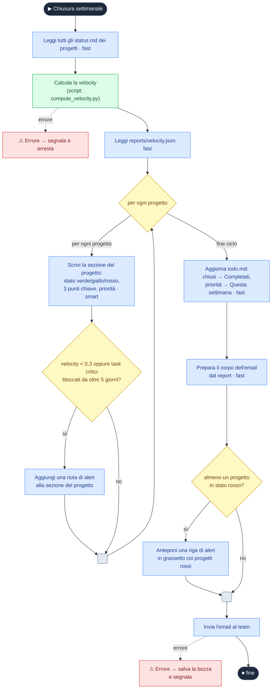

# L'agente è il runtime: scrivere processi che un'AI esegue

*Per analisti di business e responsabili di processo. Primo di tre articoli. 2026-09-01.*

> **Come è stato scritto questo articolo, e perché ve lo dico.**
>
> Il testo che state leggendo l'ha steso un'AI. Non lo dichiaro per scrupolo formale: lo dichiaro
> perché tacerlo contraddirebbe proprio ciò di cui l'articolo parla, cioè dove conviene mettere il
> lavoro umano quando una macchina scrive ed esegue.
>
> La divisione è stata questa. L'idea di SOL, il disegno del formato e le ragioni per cui è fatto
> così sono miei. La stesura, l'organizzazione del materiale e il lavoro di verifica su cui si
> regge sono della macchina, condotti insieme e riletti riga per riga. E una decisione in
> particolare l'ho presa io: **fermare questo articolo prima delle conclusioni.** Troverete, alla
> fine, delle domande a cui, in cinque mesi di lavoro, ho potuto finalmente rispondere.
>
> È il confine che mi interessa mostrarvi: la macchina scrive ed esegue, la firma su cosa si può
> affermare resta di una persona.
>
> — Gianni Tommasi

## Il fossato che ogni analista conosce

Da una parte c'è il *descrivere* un processo: una procedura scritta, una slide, un diagramma BPMN,
una user story. Dall'altra c'è il *farlo eseguire*: e lì serve qualcuno che traduca la descrizione
in codice, in un workflow, in un'integrazione. Fra l'intento e l'esecuzione si apre un fossato, e su
quel fossato l'analista costruisce da sempre un ponte fatto di specifiche, hand-off verso l'IT e
cicli di validazione.

Gli agenti AI promettono di colmarlo: descrivi il compito in linguaggio naturale, un modello lo
esegue. Chi ci ha provato sa dove si rompe. Un prompt lungo regge finché il processo è lineare;
appena compaiono diramazioni ("se il progetto è in ritardo, allora..."), cicli ("per ogni
cliente...") o eccezioni, la prosa diventa ambigua e l'agente improvvisa. Il punto debole non è la
capacità del modello: è la **forma** con cui gli diamo le istruzioni.

Non a caso, in due anni, il mestiere si è spostato dal *prompt* al *context* fino all'*harness
engineering*: livelli sempre più profondi di costruzione dell'interazione, per ottenere da un
sistema non deterministico quella ripetibilità che ai sistemi algoritmici non dobbiamo chiedere.

C'è però una questione che viene prima di queste, e non è di tecnica: è di governance. Il prompt è
diventato **il posto dove vive la regola di business**. Non solo l'istruzione operativa: la soglia,
l'eccezione, la precedenza fra due casi, tutto ciò che l'azienda ha deciso su come si tratta una
pratica. Un blocco di prosa dentro un prompt non è un posto dove una regola aziendale possa vivere in
modo governabile: non si versiona in modo utile, non si firma, non si confronta con la versione che
l'esperto aveva approvato. Quando qualcosa va storto, nessuno sa dire *quale regola* l'AI abbia
applicato.

Il fossato, allora, non sta solo fra l'intento e l'esecuzione. Sta nel fatto che lungo il percorso le
regole si ritraducono a mano, una volta per formato, e ogni ritraduzione può cambiarle senza che
nessuno lo sappia.

SOL nasce per separare le due cose: la regola sta in un posto, le sue rappresentazioni si generano da
lì.

## Che cos'è SOL

**SOL** (*Simple Orchestration Language*) è un formato per definire processi, non un linguaggio di
programmazione. Il processo si scrive una volta come documento JSON minimale, con la struttura
esplicita — condizioni, ramificazioni, cicli, punti di arresto, eccezioni — e le singole istruzioni
in linguaggio naturale.

Il principio cardine: **l'agente è il runtime**. Negli approcci tradizionali serve un interprete, un
SDK o un motore di orchestrazione che esegue il flusso. In SOL non c'è nulla da installare: il
documento *è* la specifica, e l'intelligenza che lo esegue è lo stesso agente che lo legge. Niente
oggetti da disegnare su piattaforme dedicate, nessuna dipendenza tecnica dietro le quinte.

Per un analista la conseguenza è diretta: la distanza fra "la specifica di processo che scrivo" e
"ciò che viene eseguito" si accorcia drasticamente. Il documento che descrive il processo è il
documento che lo governa.

## Come funziona: l'inversione di controllo

Conviene fermarsi qui, perché è facile fraintendere SOL riducendolo a "istruzioni in pseudocodice".
Non è quello il punto.

Nell'automazione classica, anche quella che integra l'AI, al comando c'è un'orchestrazione
**deterministica** — un motore a regole, un workflow, uno script — che guida il flusso e, nei punti
dove serve giudizio, chiama un modello per un compito specifico: classificare, riassumere, estrarre.
L'intelligenza è un componente accessorio, un plugin invocato da una pipeline meccanica che resta
saldamente al comando.

SOL ribalta la direzione della chiamata. Al comando c'è **l'agente**, che orchestra il processo nel
suo insieme, e *scende* nel deterministico — comandi esatti, script, calcoli — quando e dove
l'esattezza conta. Il deterministico non è più il motore che chiama l'AI: è ciò che l'AI chiama.

Da qui due istruzioni di base:

- **TODO**, istruzione *interpretativa*: dichiara un esito desiderato e lascia all'agente il *come*
  — quali file leggere, quali strumenti usare, come recuperare da un imprevisto. È dove vive il
  giudizio. E non è una parola scelta a caso: i piani degli agenti sono to-do list, quella parola è
  già nel loro vocabolario nativo.
- **RUN**, *comando letterale*: eseguito esattamente come scritto, nessuna reinterpretazione. È
  l'operazione algoritmica precisa che l'agente invoca quando il risultato deve essere
  riproducibile — proprio quello script, proprio quel calcolo.

Un esempio chiarisce come la prevedibilità si governi con le convenzioni:

```
TODO: crea la versione inglese del file pippo.txt
RUN: python send_to_server.py {{versione inglese di pippo.txt}}
```

L'agente distingue le due istruzioni — *fai questa cosa con la tua intelligenza* contro *esegui
esattamente questo comando* — e capisce anche a cosa si riferisce il testo fra doppie graffe. La
coerenza delle convenzioni, e la loro somiglianza con ciò su cui il modello è stato addestrato, è
ciò che rende l'interpretazione affidabile.

## La regola deve sopravvivere al passaggio

Un requisito non nasce eseguibile. Passa di mano: qualcuno lo raccoglie da chi conosce il mestiere,
qualcuno lo formalizza, qualcuno lo disegna per farlo approvare, qualcuno lo traduce in qualcosa che
gira. A ogni giunzione la regola viene riscritta a mano in un'altra forma, e ogni riscrittura è un
punto dove può cambiare di nascosto. Non serve malafede: basta una condizione che nel diagramma
diventa "se il progetto è critico" mentre la specifica diceva "critico oppure bloccato da oltre
cinque giorni".

Il presidio classico è tenere allineate le copie, e chiunque abbia mantenuto un BPMN accanto al
codice sa come finisce. Le copie divergono, la divergenza si scopre a valle, e a quel punto nessuno
sa più quale versione fosse quella approvata.

SOL propone l'altra strada: un artefatto solo attraversa il percorso, e le altre rappresentazioni
sono proiezioni che si rigenerano invece di essere mantenute.

```
requisito in prosa · pseudocodice · YAML · XML/BPMN
                        │
                   processo SOL  ←── qui vive la regola
          ┌─────────────┼─────────────┐
      diagramma       prosa       il prompt
  (mermaid, draw.io)            che viene eseguito
```

Gli strumenti che fanno i passaggi stanno nel repository. Quello che conta è cosa ciascuno
garantisce, perché le due direzioni non danno la stessa garanzia.

**Verso i diagrammi la conversione è deterministica.** `sol2mermaid.py` e `sol2drawio.py` sono puro
Python 3: nessuna dipendenza da installare, nessuna chiamata di rete, stesso ingresso stessa uscita,
meno di un secondo anche su processi grandi. Il diagramma che mostrate in riunione non è una copia da
tenere allineata: si rigenera dalla fonte, e sta in una pipeline di build o in un hook pre-commit
senza altro requisito che Python. La corrispondenza fra costrutti SOL e primitive di flowchart è
completa, nel senso che non esiste costrutto senza una forma sul diagramma.

**Verso la prosa le rese sono due.** Una è deterministica quanto i diagrammi: un renderer riscrive il
processo in linguaggio corrente senza modello nel mezzo, ed è riproducibile carattere per carattere.
L'''altra la produce un modello in un passaggio solo, ed è qui che la parola *verificabile* va
guadagnata. La ottengo con un prompt congelato: nessuna conversazione, nessun ritocco a mano del
risultato, e il modello dichiarato per iscritto dentro il prompt. Con due regole che contano più del
testo del prompt. La prima: se la prosa prodotta legge male, il difetto è del prompt e si corregge
lì, mai nell'''output, e i documenti si rigenerano. La seconda: un documento prodotto con un altro
modello, o con un'''altra versione del prompt, è un artefatto diverso e va etichettato come tale.

Sono le tre cose che a un prompt scritto a mano mancano, e per cui sopra ho detto che non è un posto
dove una regola possa vivere. Si versiona. Si firma. Si confronta con la versione approvata.

Sul documento, infine, c'è un controllo meccanico. `sol-lint.py` verifica i segnaposto malformati, i
riferimenti irrisolti, i valori di ritorno che non corrispondono al contratto dichiarato, il flusso
di controllo sepolto in prosa. Con un effetto collaterale che ho scoperto dopo averlo scritto: rileva
anche quando una cosa **non** dovrebbe essere SOL. Se un processo passa il lint con soli avvisi di
istruzione troppo lunga, distribuiti su una sequenza piatta e priva di costrutti veri, non è SOL
scritto male: è prosa travestita, e va riscritta in prosa. Uno strumento che sconsiglia il proprio
formato mi serve più di uno che lo promuove.

### Cosa si perde nel passaggio, elencato dal convertitore

Scrivere il convertitore verso la prosa mi ha dato una cosa che non cercavo: l'elenco preciso di ciò
che il passaggio smarrisce.

La prosa non ha struttura. Tutto quello che SOL porta *nella* struttura, in prosa deve diventare una
frase esplicita, o si perde. Il prompt lo elenca voce per voce, e non per completezza: senza
quell'elenco il testo prodotto risultava fedele a leggerlo e infedele a eseguirlo.

- che un pezzo di lavoro si ripete, su cosa si ripete, e che finito un giro si torna a capo;
- dove finisce un ramo: quali istruzioni valgono per un caso solo, e quali valgono comunque;
- l'ordine dentro un caso. Un caso che registra qualcosa e chiude la lavorazione va scritto con la
  registrazione per prima, perché chi legge fa le cose nell'ordine in cui le trova;
- una chiusura anticipata: cosa si ferma, cosa resta come sta, cosa è stato accumulato fino a lì;
- quale caso vince, quando due potrebbero essere veri della stessa cosa.

Questo elenco è la risposta al fossato da cui siamo partiti. Non argomenta che la prosa sia ambigua:
è il verbale di cosa è servito dire a voce perché non lo fosse. E sono i punti esatti in cui una
regola di business si rompe passando da un formato all'altro.

## SOL come BPMN che si esegue

Gli analisti vivono nei diagrammi, e ogni costrutto di SOL corrisponde a una primitiva di flowchart
già nota: passi sequenziali, decisioni, cicli, eccezioni, terminazione. Non è un caso, ed è la
ragione per cui la proiezione verso il diagramma può essere meccanica invece di essere ridisegnata a
mano. Non serve che vi dica quanto valga una rappresentazione grafica per far emergere carenze di
processo e casi non gestiti.

Un processo reale — la **chiusura settimanale dei progetti**: ogni venerdì leggere lo stato di tutti
i progetti, calcolare la velocity, scrivere un report per progetto, aggiornare la to-do list e
inviare il riepilogo al team.



> **Legenda** — Blu: passi *interpretativi* (l'agente decide il come). Verde: comando *letterale*
> (lo script di calcolo, eseguito esattamente). Giallo: decisioni e cicli. Rosso: eccezioni.

Si legge come un qualsiasi diagramma di processo, e qui sta il valore per chi fa analisi. Tre cose
meritano attenzione:

- **Le condizioni sono regole di business in linguaggio naturale.** "Almeno un progetto in stato
  rosso", "velocity sotto 0,3 o task critici bloccati da oltre 5 giorni" sono giudizi che un motore
  tradizionale non saprebbe valutare senza una definizione formale e calcolabile. L'agente le
  risolve rispetto al contenuto reale dei file. La regola resta scritta come l'analista la
  scriverebbe, non tradotta in un predicato.
- **C'è un solo punto deterministico, ed è esplicito.** Un numero non si interpreta. La separazione
  fra giudizio e calcolo è visibile a colpo d'occhio.
- **Le eccezioni sono parte del processo**, non un dettaglio implementativo: sono esattamente i
  percorsi alternativi che un analista mappa già in un BPMN.

Il punto strategico è quello di prima: il diagramma che mostrate allo stakeholder e la specifica che
viene eseguita nascono dallo stesso posto. Nessun diagramma che diverge dal codice perché qualcuno ha
aggiornato l'uno e dimenticato l'altro.

## Dove si colloca SOL

Il panorama dell'orchestrazione AI ha oggi tre famiglie: i **framework code-first** (LangGraph,
CrewAI, AutoGen), che modellano l'interazione fra agenti scrivendo codice — massima flessibilità e
controllo, ma sviluppo e DevOps significativi; le **piattaforme dati integrate** (Snowflake,
Databricks), dove l'orchestrazione avviene dove risiedono i dati, con forte governance e rischio di
lock-in; le **architetture ibride enterprise**, dove una backbone deterministica garantisce audit e
ripetibilità e l'AI interviene solo dove serve capacità interpretativa.

SOL si colloca come **livello intermedio di automazione**. Non compete con un motore enterprise
quando l'esigenza è riproducibilità e audit rigorosi; non richiede il costo di sviluppo di un
framework code-first quando l'esigenza è descrivere un processo e farlo eseguire da un agente
capace.

| | Framework code-first | **SOL** |
|---|---|---|
| Chi guida l'esecuzione | un motore deterministico | l'agente |
| Forma della definizione | codice (Python) | documento leggibile, convertibile in prosa e in diagramma, nei due versi |
| Chi può scriverlo | sviluppatori | chi sa descrivere un processo |
| Costo di adozione | alto (SDK, infrastruttura) | minimo (nessun runtime) |
| Riproducibilità | alta | dove serve, via comandi letterali |
| Punto di forza | controllo fine, scala | dall'intento all'esecuzione senza traduzione |

In sintesi: **si usa SOL** quando il processo è abbastanza complesso da beneficiare del giudizio di
un agente, ma abbastanza strutturato da richiedere indicazioni chiare su cosa fare e quando. **Si
usa un framework** quando servono riproducibilità byte-per-byte, latenza garantita o
un'orchestrazione di cui rispondere in sede di audit.

## Casi d'uso

Gli scenari più naturali sono i processi ricorrenti, basati su conoscenza, dove ogni esecuzione
richiede un po' di giudizio ma la struttura è stabile:

- **Reportistica e briefing ricorrenti.** Un briefing quotidiano che legge lo stato dei progetti, fa
  emergere ritardi e scadenze imminenti e produce un riassunto. La struttura è fissa, il contenuto
  cambia ogni giorno.
- **Cicli di chiusura periodica.** La chiusura settimanale vista sopra: aggregazione di stato,
  calcolo di metriche, redazione di un report per entità, aggiornamento di una lista, comunicazione
  al team. Mescola passi interpretativi e un passo deterministico.
- **Processi di revisione e controllo.** Un runner che, dato un insieme di modifiche, applica una
  checklist, delega l'analisi a un agente specializzato e raccoglie i risultati con severità e
  suggerimenti.

Lo schema ricorrente è sempre lo stesso: **intento di business → struttura del flusso → l'agente
esegue**. L'analista lavora al primo e al secondo livello; il terzo è demandato all'agente.

## I limiti, detti prima che ve li trovi qualcun altro

SOL non pretende di sostituire gli altri strumenti: è pensato per *innestarsi*. Può definire le
*skill* di un agente dentro ambienti come Claude Code o Cursor, convivere con framework esterni che
possiedono il controllo di flusso mentre SOL descrive cosa fa ciascun nodo, prestarsi a scenari di
interoperabilità fra agenti.

Ma qui serve il tipo di onestà che un analista pretende prima di portare una tecnologia agli
stakeholder. **SOL esprime un intento; il linguaggio da solo non può garantirne la realizzazione.**
Alcune cose dipendono dal contesto d'esecuzione, e vanno presidiate lì, non promesse dal documento:

- **L'isolamento fra agenti e la scelta del modello.** SOL può dichiarare che un sotto-compito giri
  in un contesto separato o su un modello più capace, ma è l'ambiente di esecuzione a doverlo
  rendere reale. Il documento lo *chiede*; non lo *impone*.
- **La pausa per l'intervento umano.** Esiste un'istruzione per marcare un punto di controllo dove
  serve una decisione umana. Esprime bene l'intento, ma è una scorciatoia dipendente dal contesto:
  funziona se l'esecuzione è garantita interattiva, altrimenti degrada a un arresto pulito. Per un
  gate umano che regga in *ogni* contesto — il caso tipico della governance — il pattern robusto è
  la **decomposizione**: due processi distinti, con la decisione umana in mezzo.

E due cose SOL non le fa di proposito: non prescrive la strategia di esecuzione (cosa
parallelizzare, in che ordine), che deduce l'agente; e non garantisce determinismo, perché due
esecuzioni possono differire quando l'agente esercita giudizio. Dove serve riproducibilità esatta,
la risposta è un comando letterale verso uno script.

Sono scelte, non lacune. SOL copre uno sweet spot preciso: processi abbastanza complessi da
beneficiare della comprensione di un agente, abbastanza strutturati da richiedere una guida su cosa
fare e quando.

## Ma funziona davvero?

Fin qui la proposta. Ed è, appunto, una proposta: un ragionamento coerente su come conviene scrivere
un processo perché un'AI lo esegua.

Un ragionamento coerente non è un'evidenza. Sotto SOL ci sono due affermazioni che quando ho iniziato a pensarci avevo
scritto nero su bianco dandole per plausibili:

1. istruzioni strutturate in JSON sono interpretate meglio delle stesse istruzioni in prosa;
2. alcune parole chiave — `TODO`, `RUN`, `{{segnaposto}}` — sono abbastanza chiare e universali da
   essere interpretate senza spiegazioni aggiuntive.

Plausibili non significa vere.

Le mie implementazioni attuali hanno dato risultati più che incoraggianti: ho diverse skill strutturate in SOL di cui, nell'uso
concreto, non ho motivo di lamentela. Ma un'esperienza non è una misura.

Così ho smesso di argomentare e ho misurato.

Metà del valore di SOL non ha avuto bisogno di misure, e non la metto tra parentesi: è il motore.
La regola in un posto solo, da leggere, discutere con chi la deve approvare, proiettabile in
un diagramma e in un testo che si rigenerano, in grado di far scaturire test automatici: sono benefici 
e valore che da soli a mio avviso giustificano lo sforzo.

L'altra metà del valore sta nella domanda:

> **Ma un'AI lo capisce davvero?**

Su un modello di frontiera la risposta la davo per scontata — ed è appunto un darla per scontata,
non un saperla. Sotto, però, la domanda si apre in tre, e sono le tre a cui ho voluto rispondere con
dei numeri:

1. **Un modello più piccolo — di quelli che girano su una macchina normale, in casa vostra —
   capisce SOL così com'è?** Senza aiuti, senza contorno, il documento e basta.
2. **E se dello stesso processo preparo una versione in prosa, ottengo un risultato migliore?**
   Perché se la risposta è sì, il formato strutturato è una comodità per l'analista che si paga in
   esecuzione — ed è un prezzo che va conosciuto.
3. **E se, oltre alle istruzioni, gli passo anche le spiegazioni su come interpretarle, miglioro o
   peggioro?** L'istinto dice che spiegare aiuti sempre. L'istinto, con questi sistemi, è un
   pessimo consigliere.

Per rispondere ho costruito una campagna: un processo di triage del supporto su richieste reali,
cinque modelli locali di taglia piccola in sei configurazioni, sette forme diverse dello stesso
identico algoritmo, **4.581 esecuzioni concluse**, con le ipotesi depositate *prima* di lanciare — in modo da potermi smentire.

Le risposte non sono state quelle che mi aspettavo, e una in particolare mi ha costretto a cambiare
il modo in cui presento SOL. In meglio, ed è la parte che non avevo previsto.

Strada facendo, poi, sono emerse due cose che non stavano in nessuna delle domande di partenza e che
non riguardano SOL: riguardano **qualunque** processo decidiate di far eseguire a un'AI, con
qualunque strumento. Dove si rompe esattamente — che non è dove ve lo aspettate — e quanto vi costa
chiedere all'esecutore di mostrare il lavoro.

**Sono il prossimo articolo.**

---

SOL è un progetto open source (licenza MIT). Per chi volesse provarlo senza scrivere JSON a mano, la
*skill* fa il viaggio in entrambi i sensi: traduce in un processo SOL valido una descrizione in
linguaggio naturale, in pseudocodice, in YAML o in XML/BPMN; e da un processo SOL rigenera il
diagramma (`sol2mermaid.py`, `sol2drawio.py`) o la prosa. Il linter `sol-lint.py` controlla il
documento. Il prompt che genera la prosa è congelato e versionato insieme al resto: è l'artefatto che
rende quella conversione ripetibile.

Repository: https://github.com/jtplugin/sol

---
*Autore: Gianni Tommasi*
